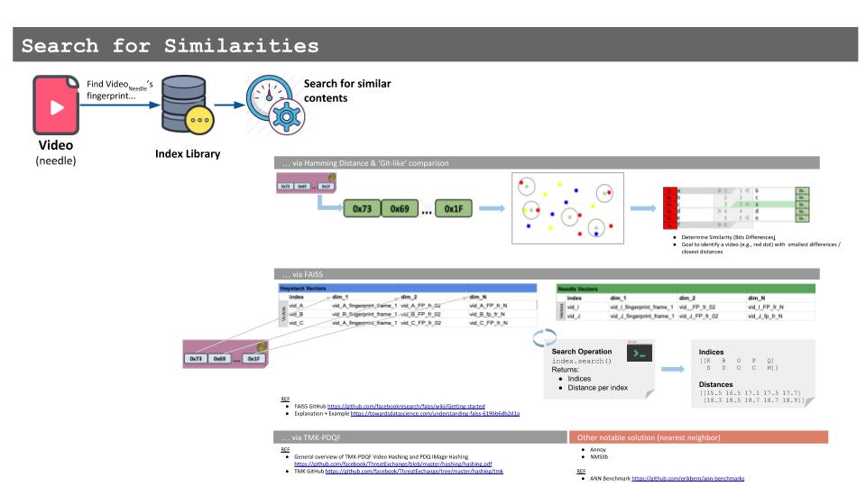

# Finding Similarities in Media Contents

## Motivations

The intention of this project \(repo\) is to showcase typical business use-cases, as well as practical guides in leveraging different techniques to sample media from its original form \(images, videos\) before searching/identifying similar contents.

## Contents

A better UI/UX of this documentation can be consume in the GitBook domain, [https://kleung-hkg.gitbook.io/media-similarities/](https://kleung-hkg.gitbook.io/media-similarities/)

### **Fingerprint**

Generating unique signature of content.

1. **Sampling**.  Best practices \(with sample code\) in extracting 'contents' from the original image / video.

   

2. **Indexing**.  Highlight various methods to create that signature \(fingerprint\) of the image / video.

   

### **Similarities**

Identifying similar content\(s\) via:

1. Finding the '**Needles from Haystack**' method

   

2. **Clustering** the indexed contents into its own group \(kNN like in ML world\)

   

## Background

There are several ways to detect differences / similarities of images and videos, and the answer kind of depends whom you ask: a Computer or a Human.

Typically, a computer is great at detecting every single bit of differences - literally.  As a result, comparing the binary representation of two images will merely highlight the exact 'same-ness' or not \(that there are some differences, even if it's one pixel difference between them\).  Such method is done by creating a "fingerprint" via hashing methods such as MD5 or SHA-256.

**Syntactic** matching is akin to a human finding copies of the original, or grouping several media assets together due to their similarities without extracting meaning from them.  For example, "for copy-detection use cases, ... \[one\] simply want to see if two images are essentially the same, having available neither prior information about the images, nor their context."1

The advantage \(compare to Semantic - below\) is the ability in identifying media that "share minimum adversariality"; for example, when image quality is reduced, JPEG converted to PNG format.

A Syntactic hasher popular in the community includes Perceptual Hashing \(pHash\), which what PDQ largely leveraged.  Other hashing concepts include aHash, dHash, and GIST.  These hasher simply compare similarity of images without extracting meaning from them.

**Semantic** matching is usually in form of an "algorithm in detecting features within images, e.g., determining that a given image is a picture of a tree."1  The "cost" of this approach are models training and an a-priori knowledge of the feature set to be recognized.

Semantic hasher usually comes in form of a machine-learning or deep-learning model.

## Use Cases

The reason I want to take a deeper dive in the area of finding similar contents \#NearestNeighbor / \#vector\_TBD is the inheritnly wide range of business use cases.

* Media Tagging
* Identifying fraudulent or copy-cat contents

## References

1. The `TMK+PDQF` Video Hashing Algorithm and the `PDQ` Image Hashing Algorithm [https://github.com/facebook/ThreatExchange/blob/master/hashing/hashing.pdf](https://github.com/facebook/ThreatExchange/blob/master/hashing/hashing.pdf)
2. `TMK` GitHub [https://github.com/facebook/ThreatExchange/tree/master/hashing/tmk](https://github.com/facebook/ThreatExchange/tree/master/hashing/tmk)
3. `FAISS` GitHub [https://github.com/facebookresearch/faiss/wiki/Getting-started](https://github.com/facebookresearch/faiss/wiki/Getting-started) 
4. `FAISS` Explanation + Example [https://towardsdatascience.com/understanding-faiss-619bb6db2d1a](https://towardsdatascience.com/understanding-faiss-619bb6db2d1a)
5. ANN Benchmark [https://github.com/erikbern/ann-benchmarks](https://github.com/erikbern/ann-benchmarks)

